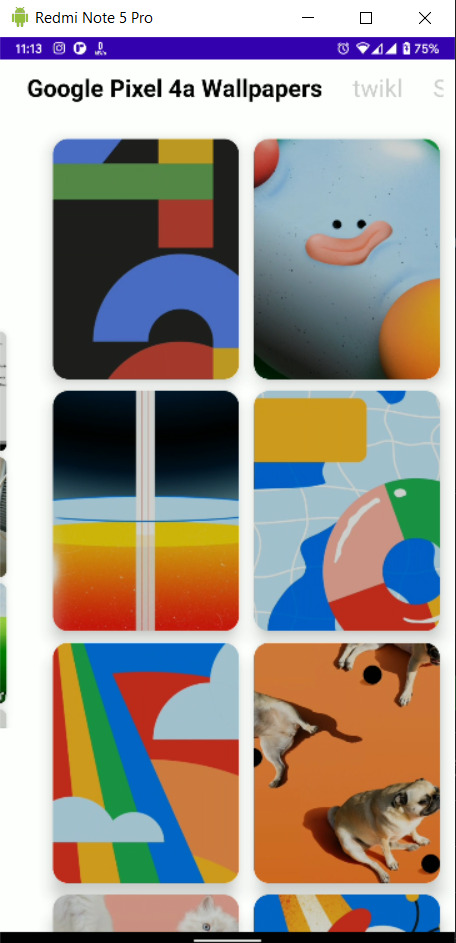
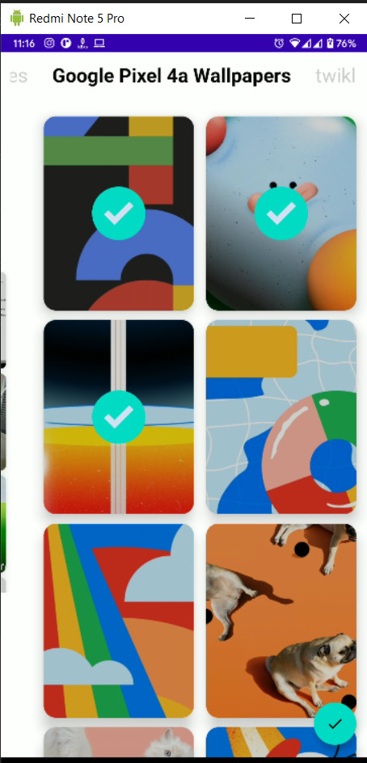

# custom-image-selection


[](https://jitpack.io/#sz32/custom-image-selection)

Download APK from Release and give it a try


How to
To get a Git project into your build:


Step 1. Add the JitPack repository to your build file 

Add it in your root build.gradle at the end of repositories:

```
allprojects {
  repositories {
    maven { url 'https://jitpack.io' }
  }
}
```

Step 2. Add the dependency

```
dependencies {
  implementation 'com.github.sz32:custom-image-selection:Tag'
}
```

How to use:

1. In your activity 
```
OpenGallery
.init(this)
.isSelectMultiple(true)
.build()
```
2. Get result :

```
override fun onActivityResult(requestCode: Int, resultCode: Int, data: Intent?) {
    super.onActivityResult(requestCode, resultCode, data)
    if (data?.extras != null) {
        toast((data.extras?.getSerializable("DATA") as ArrayList<ImagePath>).size.toString())
    }
}
```


